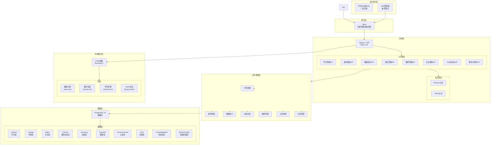
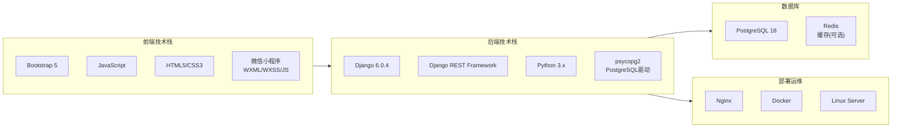
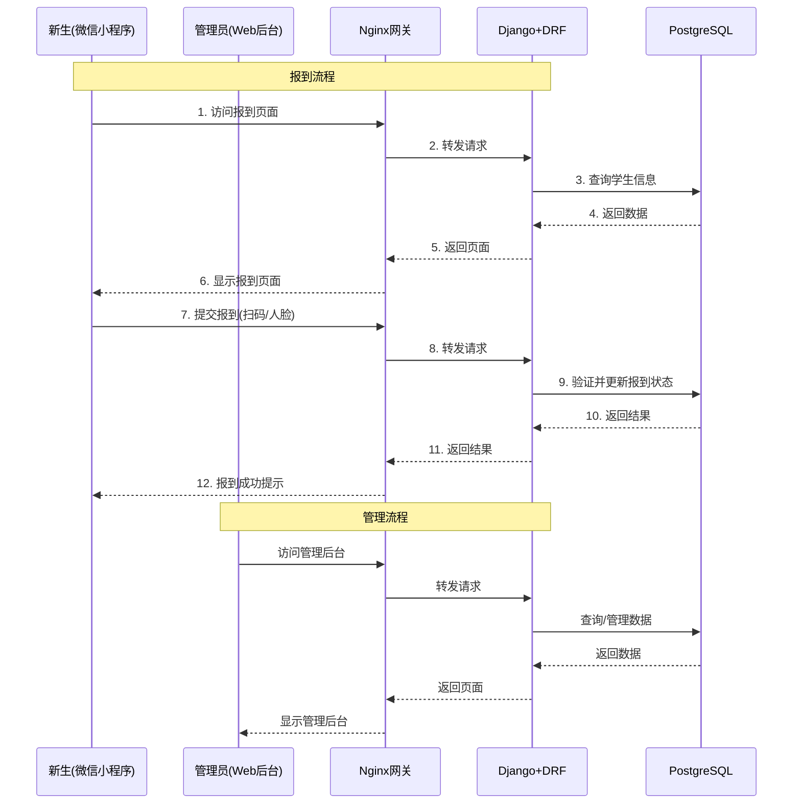
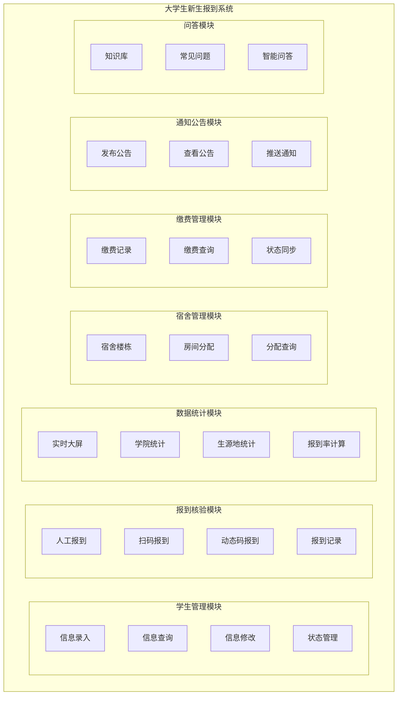
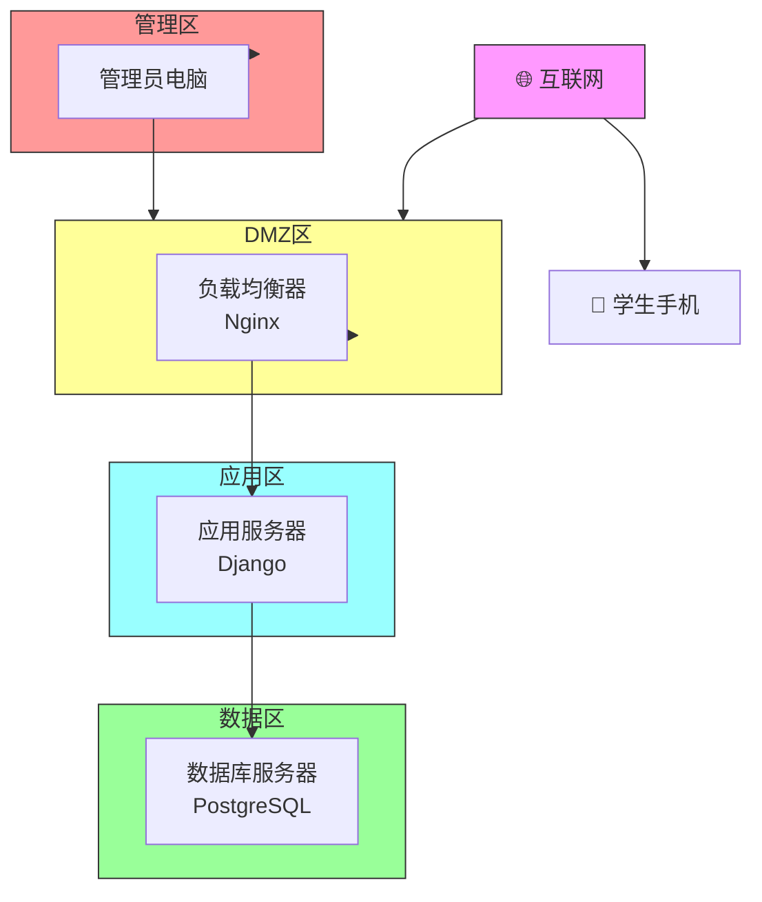
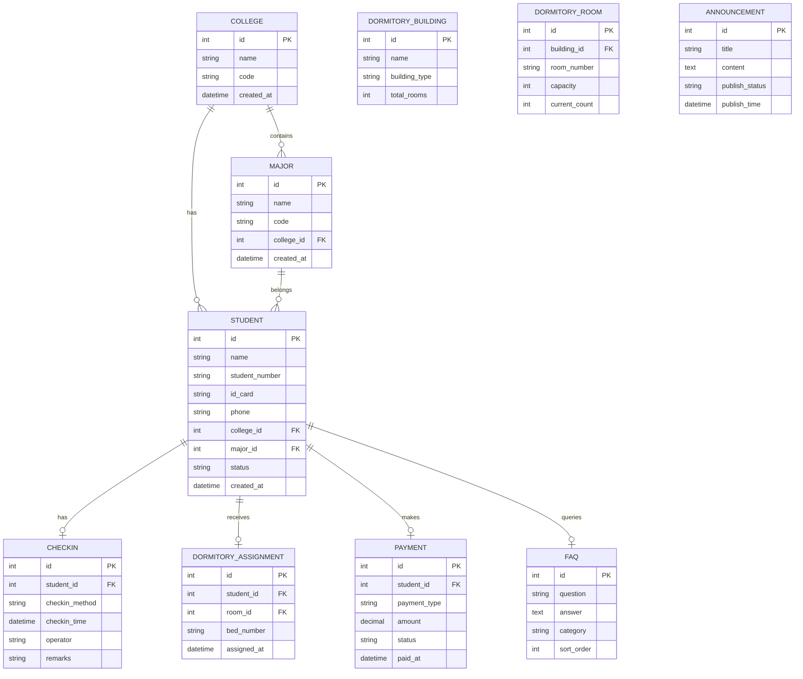
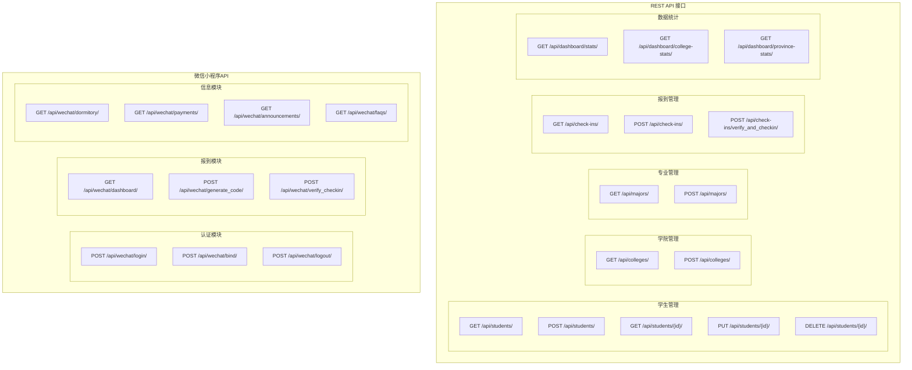
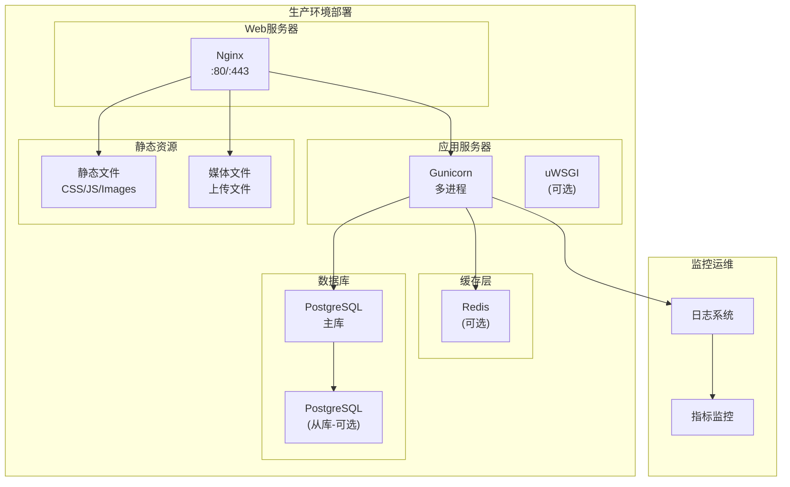

# 大学生新生报到智能助手 - MVP技术框架图

## 一、系统整体架构图

---

## 二、技术栈架构图

---

## 三、数据流架构图

---

## 四、功能模块架构图

---

## 五、网络拓扑架构图

---

## 六、数据库ER图

---

## 七、API接口架构图

---

## 八、系统部署架构图

---

*文档版本: V1.0*
*编制日期: 2026-04-25*
